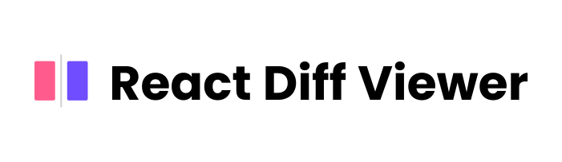

A simple and beautiful text diff viewer made with [Diff](https://github.com/kpdecker/jsdiff) and [React JS](https://reactjs.org).

Inspired from Github's diff viewer, it includes features like split view, unified view, word diff and line highlight. It is highly customizable and it supports almost all languages.

## Install

```bash
yarn add react-diff-viewer

# or

npm i react-diff-viewer
```

## Usage

```javascript
import React, { PureComponent } from 'react'
import ReactDiffViewer from 'react-diff-viewer'

const oldCode = `
const a = 10
const b = 10
const c = () => console.log('foo')

if(a > 10) {
  console.log('bar')
}

console.log('done')
`
const newCode = `
const a = 10
const boo = 10

if(a === 10) {
  console.log('bar')
}
`

class Diff from PureComponent {
  render = () => {
    return (
      <ReactDiffViewer
        oldValue={oldCode}
        newValue={newCode}
        splitView={true}
      />
    )
  }
}
```

## Props
|Prop              |Type         |Default       |Description                                   |
|------------------|-------------|--------------|----------------------------------------------|
|oldValue          |`string`       |''            |Old value as sting.                           |
|newVlaue          |`string`       |''            |New value as sting.                           |
|splitView         |`boolean`      |`true`        |Switch between `unified` and `split` view.    |
|renderContent     |`function`     |`undefined`   |Render Prop API to render code in the diff viewer. Helpful for [syntax highlighting](#syntax-highlighting)   |
|onLineNumberClick |`function`     |`undefined`   |Event handler for line number click.          |
|hightlightLines   |`array[string]`|`[]`          |List of line number to be highlighted. Works together with `onLineNumberClick`. Line number are prefixed with `L` and `R` for the line numbers on the left and right section of the diff viewer. Example, `L-20` means 20th line in the left pane. To highlight a range of line numbers, pass the line number range prefixed as an array. For example, `[L-2, L-3, L-4, L-5]` will highlight line numbers `2-5` in the left pane.   |
|styles            |`object`       |`{}`          |Object consisting of variable and style overrides. Learn more about [overriding styles](#overriding-styles)  |

## Syntax Highlighting

Syntax highlighting is a bit tricky when combined with diff. But, React Diff Viewer provides a simple render prop API to handle syntax highlighting. Use `renderContent(content: string) => JSX.Element` and your favorite syntax highlighting library to acheive this.

```html
<link href="https://cdnjs.cloudflare.com/ajax/libs/prism/1.15.0/prism.min.css" />

<script src="https://cdnjs.cloudflare.com/ajax/libs/prism/1.15.0/prism.min.js"></script>
```

```javascript
import React, { PureComponent } from 'react'
import ReactDiffViewer from 'react-diff-viewer'

const oldCode = `
const a = 10
const b = 10
const c = () => console.log('foo')

if(a > 10) {
  console.log('bar')
}

console.log('done')
`
const newCode = `
const a = 10
const boo = 10

if(a === 10) {
  console.log('bar')
}
`

class Diff from PureComponent {
  highlightSyntax = str => <pre
    style={{ display: 'inline' }}
    dangerouslySetInnerHTML={{ __html: P.highlight(str, P.languages.javascript, 'javascript') }}
  />

  render = () => {
    return (
      <ReactDiffViewer
        oldValue={oldCode}
        newValue={newCode}
        splitView={true}
        renderContent={this.highlightSyntax}
      />
    )
  }
}
```


## Overriding Styles

React Diff Viewer uses [emotion](https://emotion.sh/) for styling. It also offers a simple way to override styles and style variables.

```javascript

// Default variables and style keys

const defaultStyles = {
  variables: {
    addedBackground: '#e6ffed',
    addedColor: '#24292e',
    removedBackground: '#ffeef0',
    removedColor: '#24292e',
    wordAddedBackground: '#acf2bd',
    wordRemovedBackground: '#fdb8c0',
    addedGutterBackground: '#cdffd8',
    removedGutterBackground: '#ffdce0',
    gutterBackground: '#f7f7f7',
    gutterBackgroundDark: '#f3f1f1',
    highlightBackground: '#fffbdd',
    highlightGutterBackground: '#fff5b1',
  },
  diffContainer: {}, // style object
  diffRemoved: {}, // style object
  diffAdded: {}, // style object
  marker: {}, // style object
  gutter: {}, // style object
  hightlightedLine: {}, // style object
  hightlightedGutter: {}, // style object
  lineNumber: {}, // style object
  line: {}, // style object
  wordDiff: {}, // style object
  wordAdded: {}, // style object
  wordRemoved: {}, // style object
}
```

To override any style, simple pass the new style object to the `styles` prop. New style will be computed using `Object.assign(default, override)`.

For keys other than `variables`, the value can be an object or string interpolation. Emotion's dynamic styles are not yet supported.

```javascript
import React, { PureComponent } from 'react'
import ReactDiffViewer from 'react-diff-viewer'

const oldCode = `
const a = 10
const b = 10
const c = () => console.log('foo')

if(a > 10) {
  console.log('bar')
}

console.log('done')
`
const newCode = `
const a = 10
const boo = 10

if(a === 10) {
  console.log('bar')
}
`

class Diff from PureComponent {

  highlightSyntax = str => <pre
    style={{ display: 'inline' }}
    dangerouslySetInnerHTML={{ __html: P.highlight(str, P.languages.javascript, 'javascript') }}
  />

  render = () => {

    const newStyles = {
      variables: {
        highlightBackground: '#fefed5',
        highlightGutterBackground: '#ffcd3c',
      },
      line: {
        padding: '10px 2px',
        '&:hover': {
          background: '#a26ea1',
        },
      },
    }

    return (
      <ReactDiffViewer
        styles={newStyles}
        oldValue={oldCode}
        newValue={newCode}
        splitView={true}
        renderContent={this.highlightSyntax}
      />
    )
  }
}

```

## License

MIT
